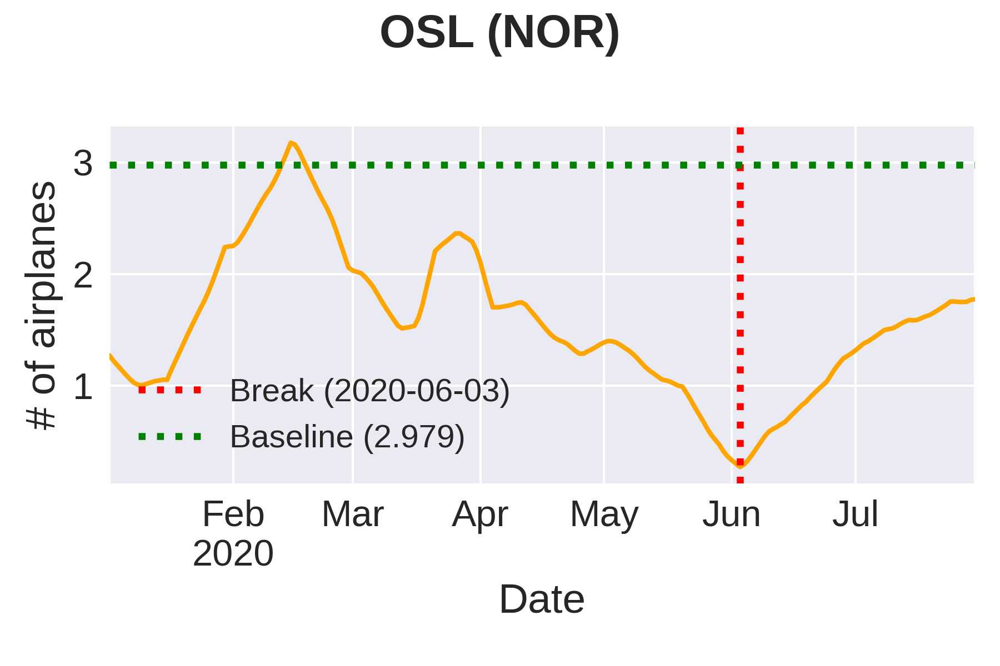

# Measuring Airport Activity from Sentinel-2 Imagery to Support Decision-Making during COVID-19 Pandemic

This repository contains the implementation of our strategy to detect structural breaks caused by the COVID-19 pandemic, in time series of detected flying airplanes through remote sensing imagery, and the recovery rate of 30 busiest airports in countries with some integration to the European Union.



## Authors

- Mauricio Pamplona Segundo ([USF](https://www.usf.edu/))
- Rodrigo Minetto ([UTFPR](http://www.utfpr.edu.br/))
- Allan Pinto ([Unicamp](https://www.unicamp.br/))
- Cole Hill ([USF](https://www.usf.edu/))
- Ricardo da Silva Torres ([NTNU](https://www.ntnu.edu/iir))
- Sudeep Sarkar ([USF](https://www.usf.edu/))

## Usage instructions

1. Clone this repository:

> git clone --recurse-submodules https://github.com/allansp84/covid19-airports-activity-analysis.git \
> cd covid19-airports-activity-analysis
2. (Optional) Install the Anaconda or Miniconda environment by following the instructions available in the [Anaconda's website](https://docs.anaconda.com/anaconda/install/) or in the [Miniconda's website](https://docs.conda.io/en/latest/miniconda.html).

3. (Optional) Create a virtual environment using Anaconda or Miniconda by running the commands below:

> conda create -n airport-analysis-env python=3.7 -y \
> conda activate airport-analysis-env

4. Install all dependencies required to run this software using the following command:

> bash install_dependencies.sh

5. To see the options available to run the software to analyze the Airports' activity, please run the following command:

> python airports_activity_analysis.py -h

6. To reproduce the results achieved by the SMA crossover method to detect the breaking point (caused by the COVID-19 pandemic) in the time series, please run the following command: 

> python airports_activity_analysis.py --time_series_path timeseries/ --breakout_algo sma-algo --output_path working 

7. To reproduce the results achieved by using the Twitter's algorithm to detect the breaking point (caused by the COVID-19 pandemic) in the time series, please run the following command: 

> python airports_activity_analysis.py --time_series_path timeseries/ --breakout_algo twitter-algo --output_path working 


## Awards

- The winner of the [RACE Upscaling Competition](https://eo4society.esa.int/2020/04/24/from-the-covid-19-custom-script-contest-to-the-euro-data-cube-european-dashboard/) launched by the European Space Agency (ESA) in coordination with the European Commission and managed by Euro Data Cube group ([Final result](https://eo4society.esa.int/2020/10/12/race-upscaling-competition-winners/)).

## Citing

If you find the code in this repository useful in your research, please consider citing:
```
TODO
```

## License
```
TODO
```


